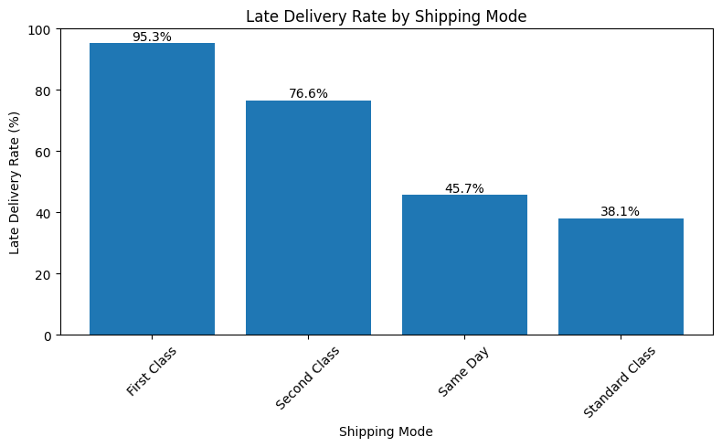
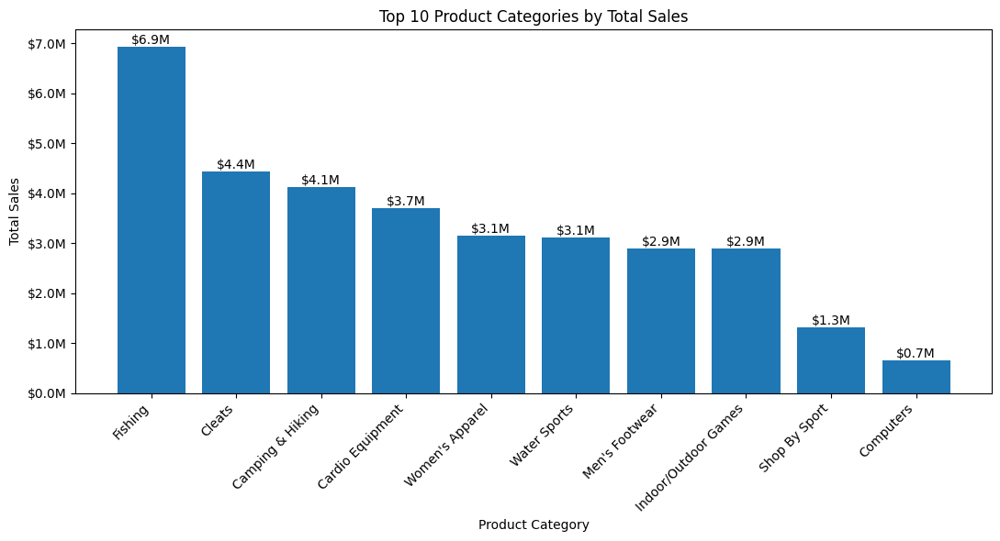
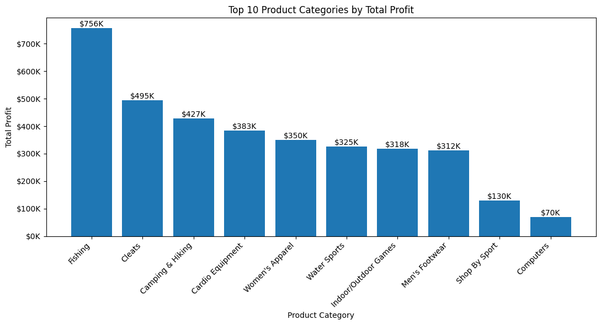
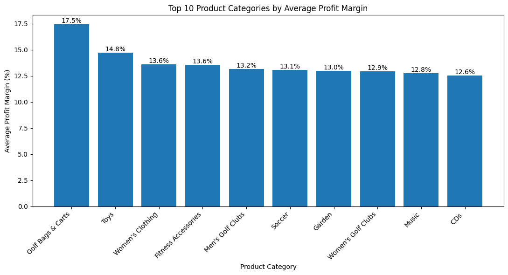
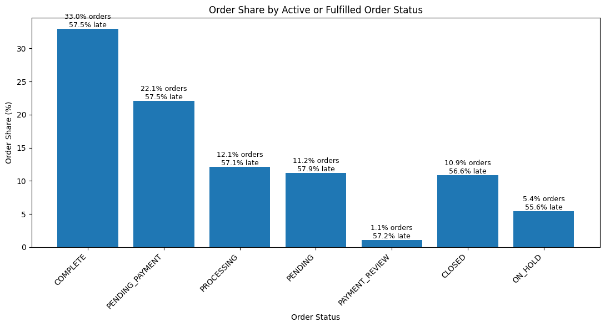

# DataCo Supply Chain Analytics

## Project Overview

This project analyzes the DataCo Supply Chain dataset to evaluate delivery performance, customer experience risk, product profitability, and fulfillment operations.

The goal of the project is to identify where delivery issues occur, which products and categories drive business performance, and which operational workflows may create risk for customer experience and revenue flow.

## Business Questions

This project answers the following questions:

1. Which shipping modes are most associated with late deliveries?
2. Are late deliveries concentrated by customer segment, market, or region?
3. Which product categories generate the most sales and profit?
4. Are the highest-sales categories also the highest-margin categories?
5. How are discount rates related to profit margins?
6. Which order statuses represent the greatest operational and financial risk?

## Tools Used

- Python
- Pandas
- NumPy
- Matplotlib
- Google Colab / Jupyter Notebook
- GitHub
- SQL
- SQLite
- Power BI or Tableau, planned

## Dataset

The analysis uses the DataCo Supply Chain dataset.

The raw and cleaned CSV files are not included in this repository because they exceed GitHub file size limits. The data folders include README files explaining how the dataset should be stored locally.

Expected local files:

- `data/raw/DataCo_SupplyChain_Dataset_RAW.csv`
- `data/processed/DataCo_SupplyChain_Dataset_Cleaned.csv`

## Repository Structure

```text
dataco-supply-chain-analytics/
│
├── dashboard/
├── data/
│   ├── raw/
│   └── processed/
├── notebooks/
├── reports/
├── sql/
├── visuals/
├── .gitignore
└── README.md
```

## Key Findings
### 1. Late delivery is a major customer experience issue

The dataset contains 180,519 total orders, with 98,977 orders flagged as late. This results in an overall late delivery rate of 54.83%.

### 2. Shipping mode is the strongest delivery performance signal

First Class and Second Class shipping had the highest late delivery rates. First Class had a late delivery rate of 95.3%, while Second Class had a late delivery rate of 76.6%.

This suggests that faster shipping options may be creating customer experience risk because fulfillment performance is not consistently meeting scheduled delivery expectations.

### 3. Customer segment and geography do not explain most late delivery variation

Late delivery rates were very similar across customer segments and markets. This suggests that late delivery is not isolated to one customer group or broad geographic market.

### 4. Product category analysis revealed specific fulfillment risk

Golf Bags & Carts had the highest late delivery rate among product categories and also had the highest average profit margin. This makes it a category worth further investigation because it combines profitability with fulfillment risk.

### 5. Revenue and profit are concentrated in a small group of categories

Fishing was the top category by both sales and profit, generating approximately $6.9 million in sales and $756K in profit. Cleats and Camping & Hiking were also major contributors.

### 6. High-margin categories are not always high-volume categories

Some of the highest-margin categories, such as Golf Bags & Carts and Toys, had lower order volume than the top revenue categories. This shows the importance of comparing sales, profit, margin, and volume together.

### 7. Order status management is an operational priority

Only 32.96% of orders were marked COMPLETE. PENDING_PAYMENT represented 22.07% of all orders and approximately $8.1 million in sales, making it an important operational workflow to monitor.


## Visual Highlights

### Late Delivery Rate by Shipping Mode



### Top 10 Product Categories by Total Sales



### Top 10 Product Categories by Total Profit



### Average Profit Margin by Product Category



### Operational Priority by Order Status



## Project Files

- `notebooks/01_data_cleaning_and_business_analysis.ipynb`: Main Python notebook for data cleaning, KPI creation, business analysis, and visualization.
- `notebooks/02_sql_business_analysis.ipynb`: SQL-focused notebook using SQLite to recreate key KPI summaries from the DataCo Supply Chain analysis.
- `visuals/`: Exported project charts.
- `data/`: Placeholder folders for raw and processed datasets.
- `sql/`: Planned reusable SQL query scripts.
- `dashboard/`: Planned BI dashboard files and screenshots.
- `reports/`: Planned executive summary and recommendations.
